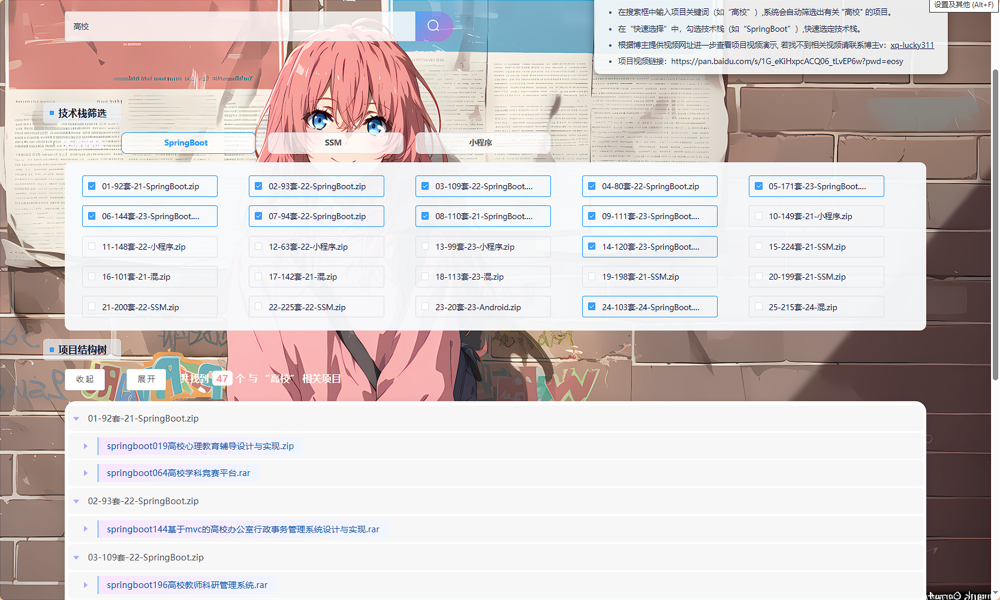

# springboot-IT技术交流和分享平台 / springboot-IT Technology Exchange and Sharing Platform


> 更多毕设项目可跳转至项目导航栏检索：[毕设项目](http://sysadmin.3vfree.vip)，需要联系博主v：xq-lucky311，q：1047944234

## 项目简介  
基于Spring Boot 2.7+ + MyBatis Plus + Shiro的IT技术交流平台，包含前后端分离架构，实现笔记分享、收藏管理、权限控制等功能。后端采用三层架构设计，前端提供管理后台和用户门户界面，支持技术文档上传、互动讨论和用户行为分析。

## 特征介绍  
- **权限控制**：集成Apache Shiro实现动态权限管理，包含自定义注解(@LoginUser)和请求拦截器  
- **高效开发**：MyBatis-Plus 2.3实现零SQL单表操作，包含自动生成DAO/Mapper层代码  
- **文件管理**：独立FileController支持多格式文件上传，集成Hutool工具类实现文件校验  
- **数据建模**：采用Entity/Model/View/VO四层数据模型结构，支持复杂业务场景扩展  
- **接口规范**：基于FastJSON实现标准化响应格式，包含统一异常处理(EIException)  
- **三方服务**：集成百度AI SDK（文字识别/内容审核）和安全加密组件(MD5Util)

## 代码结构
```
src/
├── main/
│   ├── java/
│   │   ├── com/
│   │   │   ├── annotation/          # 鉴权注解(APPLoginUser/IgnoreAuth)
│   │   │   ├── config/              # 全局配置(MybatisPlus/Interceptor)
│   │   │   ├── controller/          # 接口层(笔记/文件/公共接口)
│   │   │   ├── dao/                 # 数据访问层(XML映射文件)
│   │   │   ├── entity/              # 数据持久化对象
│   │   │   │   ├── model/           # 业务模型
│   │   │   │   ├── view/            # 视图对象
│   │   │   │   ├── vo/              # 值对象
│   │   │   ├── interceptor/         # 请求拦截器(权限校验)
│   │   │   ├── service/             # 服务层+实现类
│   │   │   ├── utils/               # 工具包(MD5/HTTP/文件处理)
│   ├── resources/
│   │   ├── mapper/                  # MyBatis XML映射文件
│   │   ├── application.yml          # 主配置(数据源/端口)
│   │   ├── static/                  # 静态资源(前端构建产物)
│   │   │   ├── admin/               # 管理后台界面
│   │   │   ├── front/               # 用户门户界面
```
## 使用说明
**环境要求**  
- JDK 1.8+ / MySQL 5.7+ / Maven 3.6+

**启动配置**  
1. 创建数据库`springboot1o52x`并执行初始化SQL
2. 修改application.yml中数据库连接信息：
   ```yaml
   url: jdbc:mysql://localhost:3306/springboot1o52x?useSSL=false
   username: root
   password: 123456
```
3. 使用SpringbootSchemaApplication启动项目

**访问地址**  
- 管理后台：http://localhost:8080/springboot1o52x/admin/dist/index.html  
  账号: abo / 密码: abo
- 用户门户：http://localhost:8080/springboot1o52x/front/index.html

**开发建议**  
- 使用IntelliJ IDEA进行后端开发
- Chrome浏览器访问时按F12开启开发者工具调试
- 文件上传目录：src/main/resources/static/upload
```

# 项目实际截图：

## 前台：


## 后台：


> 等等...

# 精选项目导航 & 快速部署工具
## 项目资源一站直达
- ​**访问项目导航站**：[点击进入](http://sysadmin.3vfree.vip)**快速检索所需项目名称**
- ​**技术栈全覆盖**：Java/SSm/Spring Boot/小程序等主流技术方案
- ​**配套资源**：每个项目均提供部署文档 + 演示视频（附效果截图）

### ▌导航站预览


### ▌工具界面预览


## 捐赠
> 博主将持续更新Java全栈开发项目，包含ssm，springboot，前后端分离系统等项目。
> 此外如果您够宽裕，请博主喝杯咖啡吧！捐赠将用于服务器维护与开源社区建设，感谢您的认可！
> 如需更多Java相关项目毕设3000+，有其他项目需求，sql文件等可联系博主v:xq-lucky311

---